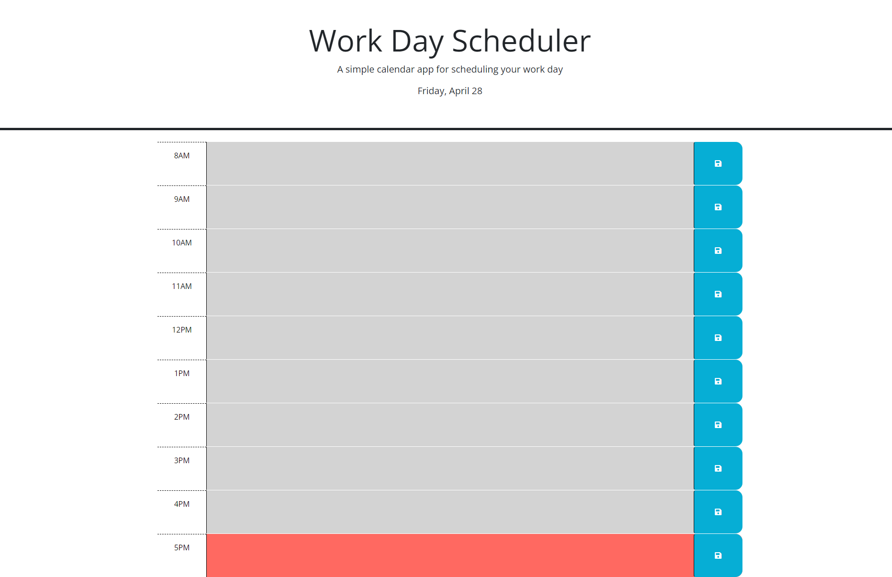

# Work Day Scheduler

Scheduling tool for planning a work day

## Description

Simple single-day planning application for saving events and quickly viewing current, past, and future time slots by color-coding.

## Usage

Users are presented with a standard work day calendar (8am-5pm).

The current day and month are displayed in the header of the application - this will update in real-time to stay current.

Each time slot has a text area for typing information pertinent to that hour's events. A corresponding save button can be clicked to store this text information in local storage so that it is retreived each time the page is accessed within the same browser (until storage is cleared).

jQuery/JavaScript IF logic are used to determine whether the calendar blocks are behind, ahead of, or in line with; the current hour of the day. Gray blocks indicate previous hours of the day, green blocks will occur after the current time, and a red block represents the current hour (hh:00-hh:59).

The site can be viewed at: https://creechj.github.io/Work_Day_Scheduler

GitHub repository for the site can be found here: https://github.com/creechj/Work_Day_Scheduler

## Credits

Resources referenced in the building of this application include:

Day.js formatting:  
https://day.js.org/docs/en/durations/format#docsNav

jQuery selectors and attribute assignments:  
https://api.jquery.com/category/selectors/  
https://api.jquery.com/attr/  

substring method for selecting hour from id's:  
https://stackoverflow.com/questions/9133102/how-to-grab-substring-before-a-specified-character-in-javascript

## License

Please refer to LICENSE included in repository